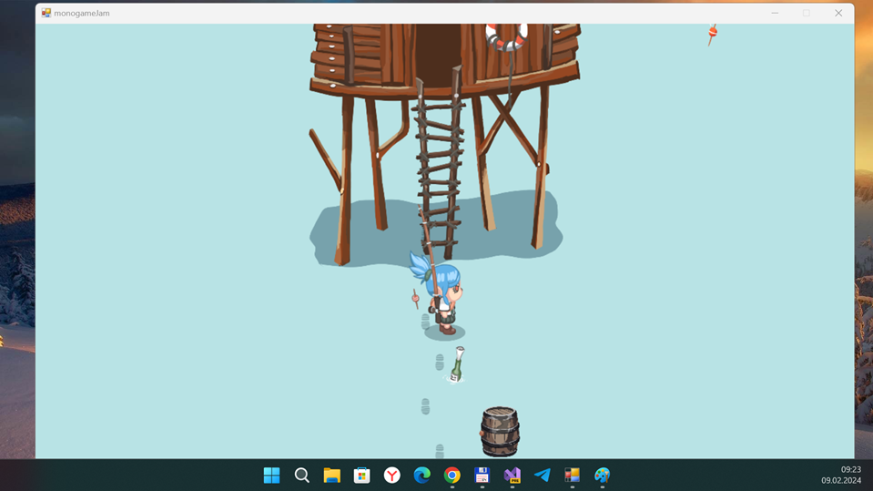

## FollowTheFootstep v1.0.3 (desktop; alpha)

This is my fork of the desktop monogame "Follow my dad's footstep" demo project by Lexyvil:
https://becher.itch.io/footstepmonogamejam

My main goal is/was: adapdation for W10M (Astoria support planned too). 

## Screenshot(s)

## My 2 cents (status)
- Fast R.E. - ready (game run - ok!)
- Some project research and minimal "re-dev" (kbd control)
- W10(M) UWP planned... but not all things explored at now (Game's OOP is real nightmare...))

## A few words (description) frow the author(original)

### Controls
- *WASD* to walk
- *Space* to jump
- *Shift* to interact with objects
- *Escape* (?) to load menu

### More information
- Status:	Prototype
- Platforms:	Windows
- Author:	Becher
- Made with:	MonoGame
- Tags:	2D, Exploration
- Video: https://www.youtube.com/watch?v=dWRj44VATBE (1 min.)

## Goals (ToDo-s)
- Create Wiki
- Explore Becher's super-cool object-oriented programming
- Add more indicators / virtual gamepad, etc.
- Add more gameplay elements
- Improve AI
- Add story elements
- Add more sound effects for everything :)

## Reference(s)
- [Becher](https://becher.itch.io/) Lexyvil at itch.io (author of original FollowFootStep proto)
- [Follow my dad's footstep](https://becher.itch.io/footstepmonogamejam) MonoGame Game Jam. Theme: Footstep.
- [Youtube - Follow My Dad's Footstep gameplay by Coconut Mousse](https://www.youtube.com/watch?v=mEGb-rgoVWQ)

## ..
As is. No support. RnD only. DIY.

## .
[m][e] 2024

